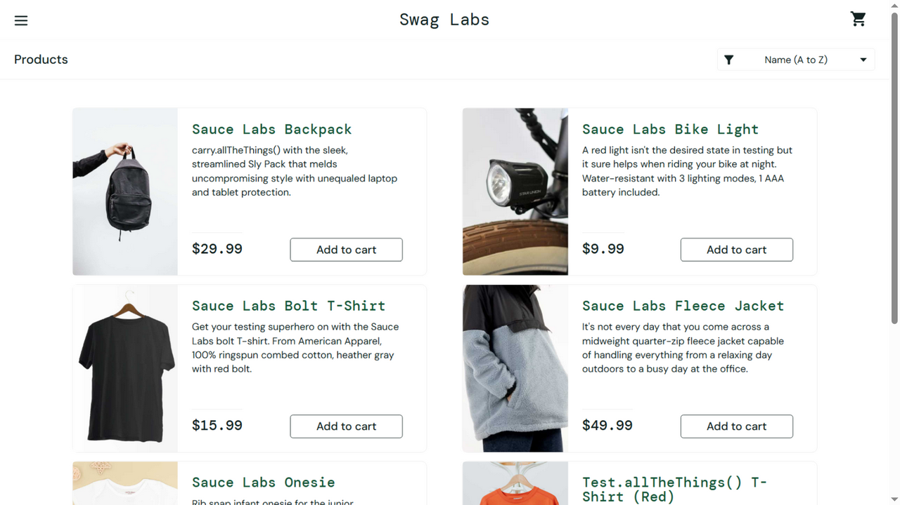
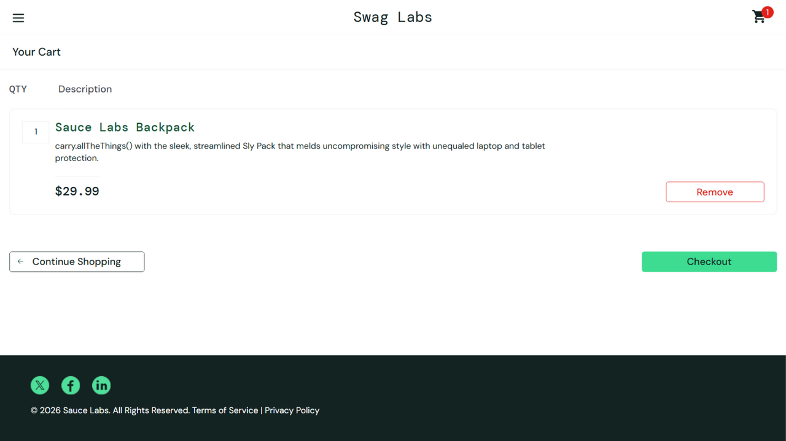
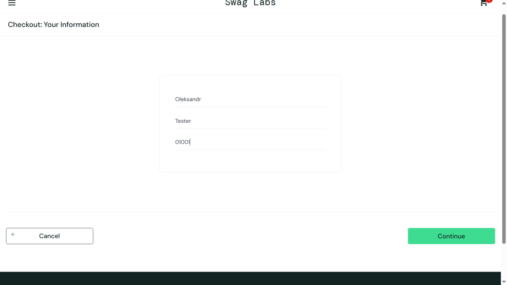
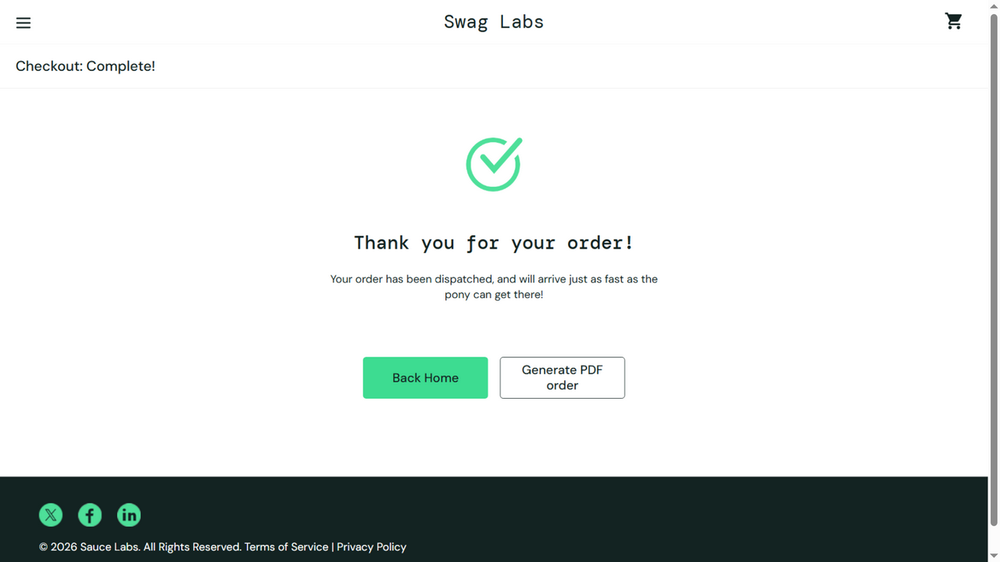
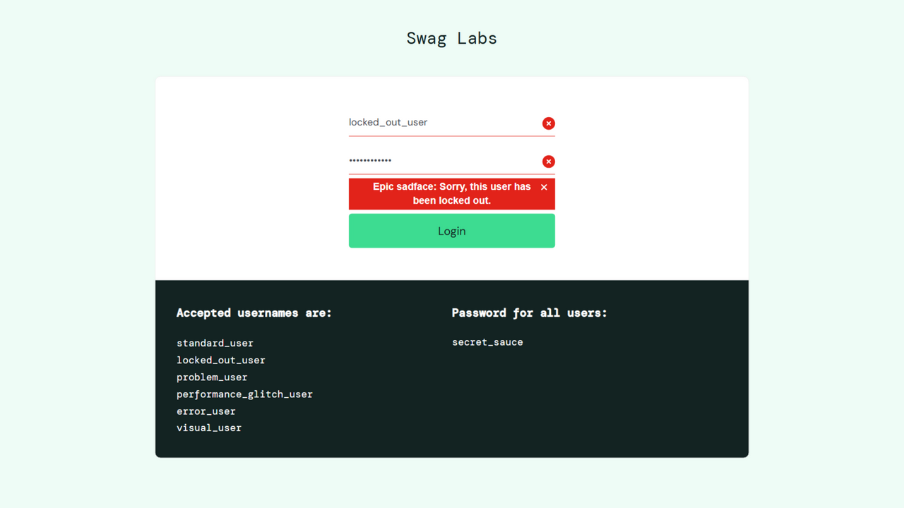
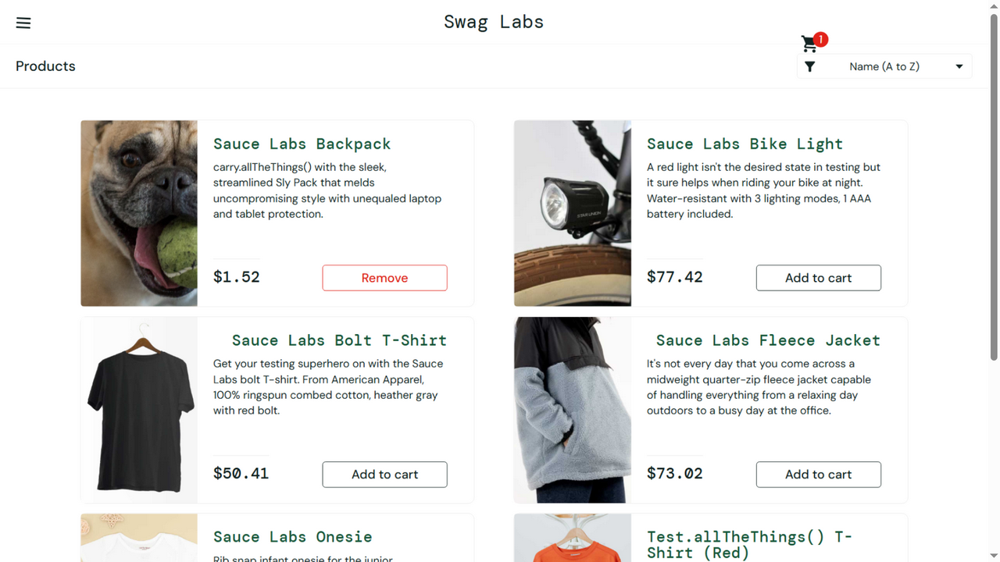
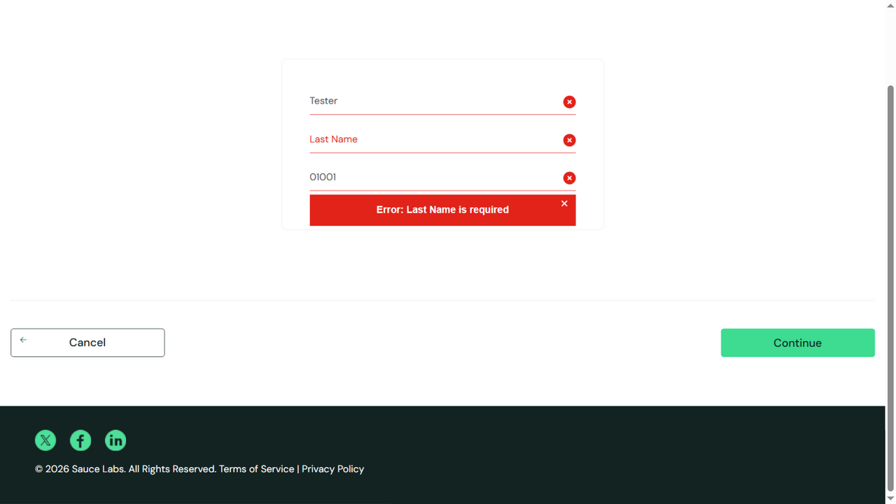

# Лабораторна робота №1

## Аналіз якості програмного продукту. Виявлення та документування аномалій

**Виконав:** Зиков Олександр

**Дата виконання:** 16.09.2026

---

## Тестовий об'єкт

**SauceDemo** - демонстраційний вебзастосунок інтернет-магазину від Sauce Labs, призначений для практики тестування.

URL: <https://www.saucedemo.com/>

## Тестове середовище

- Операційна система: Windows 10 (x64, build 19045)
- Браузер: Chromium 146.0.7680.80
- Дата тестування: 16.09.2026

## Хід роботи

1. Створено GitHub-репозиторій `software-quality` та отримано локальну копію (`git clone`)
2. Створено окрему гілку `lb1`
3. Вивчено функціональність SauceDemo та пройдено базовий сценарій за допомогою `standard_user`
4. Проведено порівняльне тестування поведінки застосунку для інших тестових облікових записів
5. Виявлені аномалії задокументовано у GitHub Issues (у цьому ж репозиторії)
6. Результати зафіксовано у цьому звіті

## Базовий сценарій (standard_user)

Повний сценарій пройдено успішно:
**Login -> Products -> Add to cart -> Cart -> Checkout -> Finish**

| Крок | Результат |
|------|-----------|
| Авторизація `standard_user` | Успішно, перехід на Products ~0.4 с |
| Додавання Sauce Labs Backpack до кошика | Успішно, лічильник кошика = 1 |
| Заповнення форми Checkout та оформлення | Успішно, сторінка Checkout: Overview з коректними сумами ($29.99 + $2.40 = $32.39) |
| Завершення замовлення (Finish) | Успішно, повідомлення "Thank you for your order!" |

Скріншоти базового сценарію:

## Порівняльне тестування облікових записів

| Обліковий запис | Спостереження |
|-----------------|---------------|
| `standard_user` | Базовий сценарій проходить повністю, аномалій не виявлено |
| `performance_glitch_user` | Помітна багатосекундна затримка відкриття сторінки Products після авторизації (~5.8 с проти ~0.4 с у standard_user) |
| `problem_user` | Зображення всіх товарів у каталозі замінені однією фотографією; у формі Checkout значення полів First/Last Name зсуваються |
| `error_user` | Кнопка Finish на сторінці Checkout: Overview не спрацьовує, замовлення неможливо завершити |
| `visual_user` | Ціни товарів не відповідають очікуваним ($1.52 замість $29.99 для Sauce Labs Backpack тощо), порушене вирівнювання заголовків карток |
| `locked_out_user` | Авторизація неможлива з помилкою "Epic sadface: Sorry, this user has been locked out.". Це очікувана поведінка заблокованого облікового запису, а не дефект |

Скріншоти тестування інших облікових записів:

## Виявлені аномалії

| № | Користувач | Короткий опис | Severity | Priority | Issue |
|---|------------|---------------|----------|----------|-------|
| 1 | performance_glitch_user | Багатосекундна затримка відкриття сторінки Products після авторизації | Medium | Medium | [#1](https://github.com/Aleksandr-Zykov/software-quality/issues/1) |
| 2 | problem_user | Зображення всіх товарів у каталозі не відповідають товарам | Medium | Low | [#2](https://github.com/Aleksandr-Zykov/software-quality/issues/2) |
| 3 | error_user | Замовлення неможливо завершити: кнопка Finish не спрацьовує | High | High | [#3](https://github.com/Aleksandr-Zykov/software-quality/issues/3) |

Повні defect reports (test environment, steps to reproduce, expected/actual result, severity, priority, evidence) оформлено у відповідних GitHub Issues.

## Додаткові спостереження

Під час тестування зафіксовано ще дві аномалії, які в межах завдання (3 аномалії) не оформлені окремими Issue:

- **problem_user**: у формі Checkout введене значення Last Name потрапляє у поле First Name, поле Last Name залишається порожнім, і з'являється помилка "Error: Last Name is required", через що оформити замовлення неможливо:

- **visual_user**: ціни товарів у каталозі не відповідають очікуваним значенням (див. скріншот вище).

## Висновок

У ході лабораторної роботи відпрацьовано базовий процес аналізу якості програмного продукту:

- пройдено базовий сценарій SauceDemo для `standard_user` та отримано еталонну очікувану поведінку;
- проведено порівняльне тестування для всіх шести тестових облікових записів;
- за правилом «Що? Де? Коли?» сформульовано Title, Expected Result та Actual Result для кожної аномалії;
- розмежовано аномалії та очікувану поведінку (заблокований обліковий запис `locked_out_user` - очікувана поведінка, а не дефект);
- задокументовано 3 аномалії у вигляді структурованих defect reports у GitHub Issues з вказанням test environment, steps to reproduce, expected/actual result, Severity та Priority;
- результати зафіксовано у гілці `lb1` цього репозиторію.

Виявлені аномалії після аналізу класифіковано як дефекти: затримка продуктивності (Issue #1), дефект відображення контенту (Issue #2) та функціональний дефект, що блокує завершення замовлення (Issue #3).
