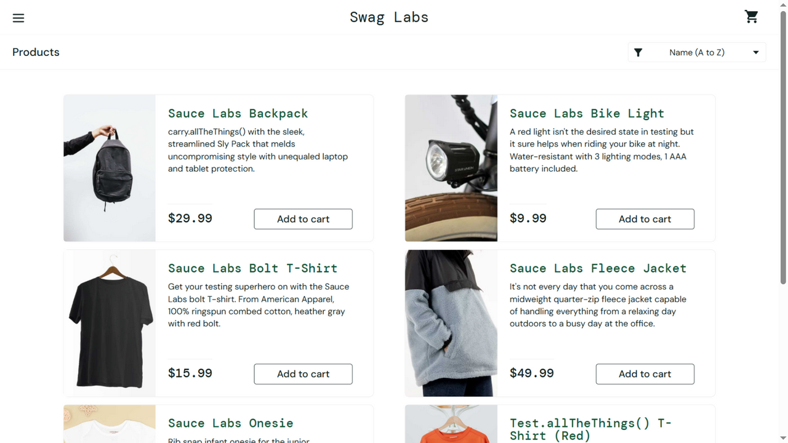
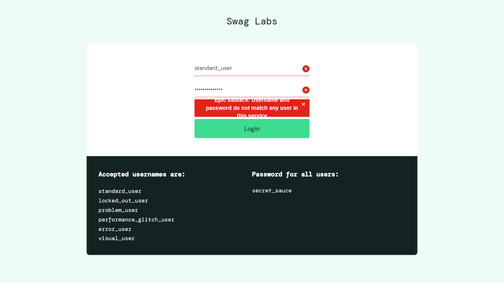
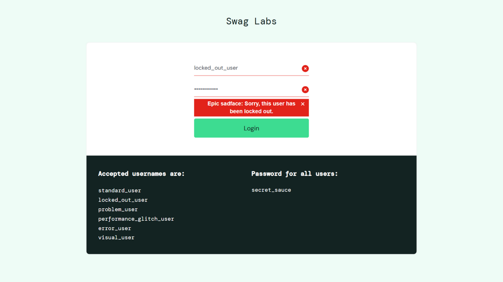

# Лабораторна робота №2

## Проєктування тестів. Checklist, Test Cases та Decision Table

**Виконав:** Зиков Олександр

**Дата виконання:** 29.09.2026

---

## Тестовий об'єкт

**SauceDemo** - демонстраційний вебзастосунок інтернет-магазину від Sauce Labs, призначений для практики тестування.

URL: <https://www.saucedemo.com/>

Функціональність, що тестується: **Login** (авторизація користувача).

## Тестове середовище

- Операційна система: Windows 10 (x64, build 19045)
- Браузер: Chromium 146.0.7680.80
- Дата тестування: 29.09.2026

## Хід роботи

1. Оновлено локальну гілку `main` (`git pull`) та створено окрему гілку `lb2` (`git checkout -b lb2`)
2. Вивчено наданий Test Basis для функціональності Login (TB-01...TB-06)
3. Визначено Test Conditions (етап Test Analysis)
4. На їх основі сформовано checklist
5. Створено один позитивний та два негативні test cases (етап Test Design)
6. Побудовано Decision Table для перевірки облікових даних
7. Виконано три створені test cases у SauceDemo та визначено Pass / Fail
8. Результати зафіксовано у цьому звіті

## Test Basis

| ID | Вимога |
|----|--------|
| TB-01 | Якщо поле Username порожнє, авторизація не виконується, повідомлення: "Epic sadface: Username is required" |
| TB-02 | Якщо Username заповнений, а Password порожній, авторизація не виконується, повідомлення: "Epic sadface: Password is required" |
| TB-03 | Допустимі usernames: standard_user, locked_out_user, problem_user, performance_glitch_user, error_user, visual_user; пароль для всіх - secret_sauce |
| TB-04 | Якщо Username і Password валідні та користувач не заблокований, після Login система переходить до /inventory.html (сторінка Products) |
| TB-05 | Для locked_out_user навіть з правильним паролем Login відхиляється: "Epic sadface: Sorry, this user has been locked out" |
| TB-06 | Якщо Username або Password не відповідають допустимим обліковим даним, Login відхиляється: "Epic sadface: Username and password do not match any user in this service" |

## Test Conditions

Етап **Test Analysis** - відповідь на питання "Що саме потрібно перевірити?":

- TCND-01 - успішна авторизація валідного користувача (TB-03, TB-04);
- TCND-02 - авторизація з неправильним Username (TB-06);
- TCND-03 - авторизація з неправильним Password (TB-06);
- TCND-04 - авторизація з порожнім Username (TB-01);
- TCND-05 - авторизація з порожнім Password (TB-02);
- TCND-06 - авторизація заблокованого користувача (TB-05).

## Checklist

- [x] Успішна авторизація з валідними даними.
- [x] Відмова в авторизації з неправильним Username.
- [x] Відмова в авторизації з неправильним Password.
- [x] Перевірка порожнього Username.
- [x] Перевірка порожнього Password.
- [x] Відмова в авторизації заблокованого користувача.

## Test Cases

### TC-LOGIN-01 - Успішна авторизація standard_user

**Type:** Positive

**Покриває:** TCND-01 (Test Basis: TB-03, TB-04)

**Preconditions:**

- Відкрита сторінка Login SauceDemo.
- Користувач не авторизований.

**Test Data:**

- Username: standard_user
- Password: secret_sauce

**Steps:**

1. У поле Username ввести standard_user.
2. У поле Password ввести secret_sauce.
3. Натиснути кнопку Login.

**Expected Result:**

Після введення standard_user і правильного пароля та натискання Login користувач успішно авторизується і переходить на сторінку Products (/inventory.html).

**Actual Result:**

Після введення standard_user і правильного пароля та натискання Login відкрилася сторінка Products (https://www.saucedemo.com/inventory.html), каталог товарів відображається коректно.

**Result:** Pass

### TC-LOGIN-02 - Авторизація з неправильним Password

**Type:** Negative

**Покриває:** TCND-03 (Test Basis: TB-06)

**Preconditions:**

- Відкрита сторінка Login SauceDemo.
- Користувач не авторизований.

**Test Data:**

- Username: standard_user
- Password: wrong_password

**Steps:**

1. У поле Username ввести standard_user.
2. У поле Password ввести wrong_password.
3. Натиснути кнопку Login.

**Expected Result:**

Після введення standard_user і неправильного пароля та натискання Login авторизація не виконується, користувач залишається на сторінці Login, відображається повідомлення "Epic sadface: Username and password do not match any user in this service".

**Actual Result:**

Авторизація не виконана, користувач залишився на сторінці Login, відображається повідомлення "Epic sadface: Username and password do not match any user in this service".

**Result:** Pass

### TC-LOGIN-03 - Авторизація заблокованого користувача

**Type:** Negative

**Покриває:** TCND-06 (Test Basis: TB-05)

**Preconditions:**

- Відкрита сторінка Login SauceDemo.
- Користувач не авторизований.

**Test Data:**

- Username: locked_out_user
- Password: secret_sauce

**Steps:**

1. У поле Username ввести locked_out_user.
2. У поле Password ввести secret_sauce.
3. Натиснути кнопку Login.

**Expected Result:**

Після введення locked_out_user і правильного пароля та натискання Login авторизація не виконується, користувач залишається на сторінці Login, відображається повідомлення "Epic sadface: Sorry, this user has been locked out".

**Actual Result:**

Авторизація не виконана, користувач залишився на сторінці Login, відображається повідомлення "Epic sadface: Sorry, this user has been locked out."

**Result:** Pass

## Decision Table

Метод обрано, оскільки EP і BVA не застосовні (немає відповідних полів або умов), State Transition не має сенсу, а для перевірок логічно виникає питання: "Чи не пропустили ми якусь важливу комбінацію Username та Password?".

**Умови:**

- C1 - Username входить до списку допустимих?
- C2 - Password правильний?
- C3 - Користувач заблокований?

**Дії:**

- A1 - перейти до Products
- A2 - показати повідомлення про блокування
- A3 - показати повідомлення про неправильні credentials

Позначення: T = True, F = False, "-" = значення не впливає на результат.

| Умова / Дія | R1 | R2 | R3 | R4 | R5 |
|-------------|----|----|----|----|----|
| C1: Username входить до списку допустимих? | T | T | F | T | F |
| C2: Password правильний? | T | T | T | F | F |
| C3: Користувач заблокований? | F | T | - | - | - |
| **A1: Products** | X | | | | |
| **A2: Locked message** | | X | | | |
| **A3: Invalid credentials** | | | X | X | X |

**Правила:**

- R1. Username valid + Password valid + not locked = Products
- R2. Username valid + Password valid + locked = Login denied
- R3. Invalid Username + valid Password = Invalid credentials
- R4. Valid Username + invalid Password = Invalid credentials
- R5. Invalid Username + invalid Password = Invalid credentials

**Покриття правил Test Cases:**

| Правило | Test Case |
|---------|-----------|
| R1 | TC-LOGIN-01 |
| R2 | TC-LOGIN-03 |
| R4 | TC-LOGIN-02 |

**Порожній Username** та **порожній Password** до таблиці не включені: SauceDemo перевіряє їх окремо до перевірки credentials, тому ці випадки покриті окремими Test Conditions TCND-04 та TCND-05 у checklist.

**Аналіз покриття:** без окремого Test Case залишилися правила **R3** (invalid Username + valid Password) та **R5** (invalid Username + invalid Password). Створювати для них окремі TC не вимагалось, але Decision Table виконала свою практичну функцію - виявила перевірки, які могли бути пропущені. Обидва правила очікувано дають дію A3, тому ризик непокритості низький, однак за повного тестування функції Login саме їх варто додати наступними.

## Результати виконання

| Test Case | Type | Result |
|-----------|------|--------|
| TC-LOGIN-01 | Positive | Pass |
| TC-LOGIN-02 | Negative | Pass |
| TC-LOGIN-03 | Negative | Pass |

Жоден з тестів не завершився Fail, тому створення GitHub Issues не потребувалось.

## Висновок

У ході лабораторної роботи відпрацьовано повний цикл проєктування тестів за порядком **Test Basis -> Test Conditions -> Checklist -> Test Cases -> Execution**:

- на основі наданого Test Basis (TB-01...TB-06) для функціональності Login визначено 6 Test Conditions (етап Test Analysis) - відповідь на питання "Що перевірити?";
- сформовано компактний checklist, який фіксує перелік перевірок без детального опису дій;
- створено 3 детальні test cases за затвердженим шаблоном (ID, Title, Type, Preconditions, Test Data, Steps, Expected Result, Actual Result, Result): один позитивний (TC-LOGIN-01) та два негативні (TC-LOGIN-02, TC-LOGIN-03);
- Expected Result сформульовано за правилом "ЩО? ДЕ? КОЛИ / ЗА ЯКИХ УМОВ?" на основі Test Basis, а не за власним розумінням;
- побудовано Decision Table з 3 умов та 5 правил, яка систематизувала комбінації Username та Password і показала, що правила R3 та R5 залишилися без окремих Test Cases;
- всі 3 test cases виконано у SauceDemo: Actual Result зафіксовано як спостережуваний результат, усі тести отримали Result: Pass.

Важливо, що негативні тести TC-LOGIN-02 та TC-LOGIN-03 також мають результат Pass: для негативного тесту Pass означає, що система очікувано відхилила невалідні дані (заблокований користувач, неправильний пароль), а не що авторизація відбулася.
