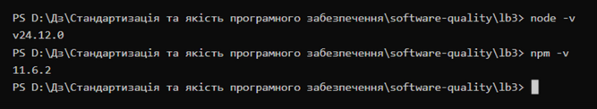
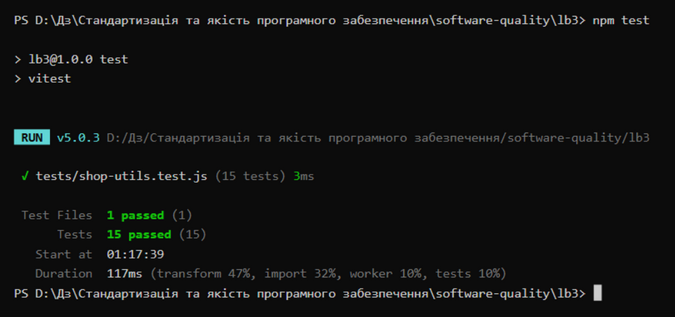
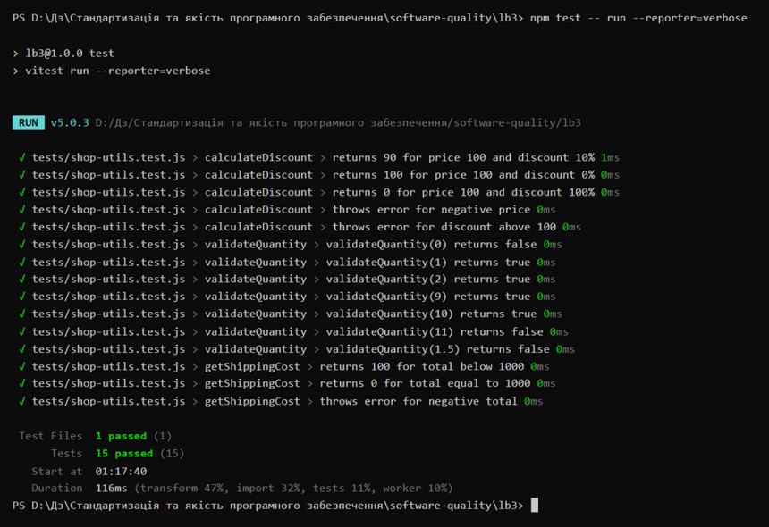
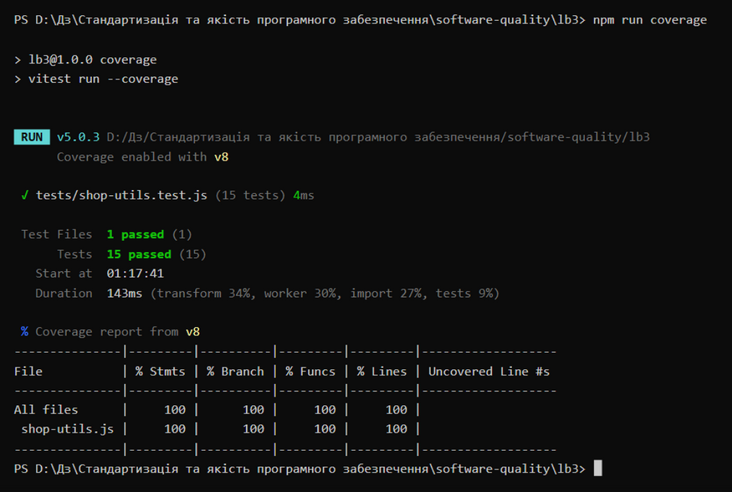
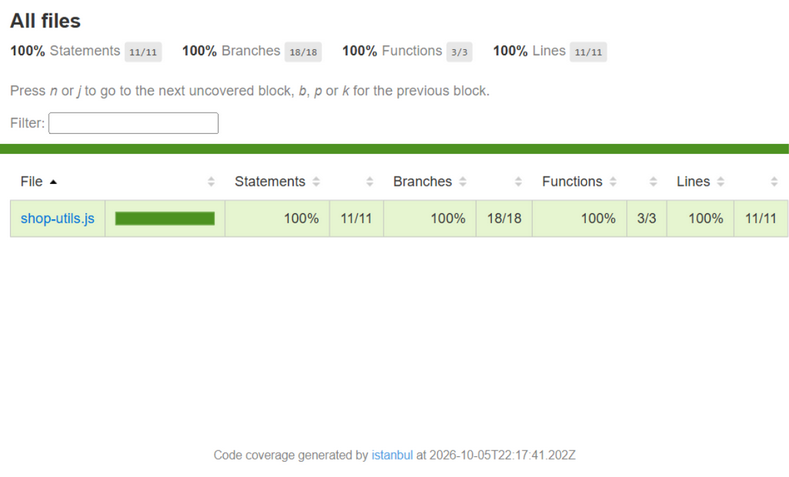

# Лабораторна робота №3

## Модульне тестування програмного коду за допомогою Vitest

**Виконав:** Зиков Олександр

**Дата:** 06.10.2026

---

## Test Object

`src/shop-utils.js` - модуль з трьома функціями:

- `calculateDiscount(price, percent)` - розрахунок ціни зі знижкою;
- `validateQuantity(quantity)` - валідація кількості товару;
- `getShippingCost(total)` - вартість доставки залежно від суми замовлення.

## Test Basis

| Функція | Правило |
|---------|---------|
| calculateDiscount | price - невід'ємне число; percent - від 0 до 100 включно; результат = price - price × percent / 100; неправильні аргументи -> Error |
| validateQuantity | тільки ціле число; допустимий діапазон 1-10 включно; допустиме -> true, недопустиме -> false |
| getShippingCost | total - невід'ємне число; total < 1000 -> 100; total >= 1000 -> 0; неправильне значення -> Error |

## Тестове середовище

- Операційна система: Windows 10 (x64, build 19045)
- Node.js: v24.12.0
- npm: 11.6.2
- Vitest: v5.0.3 (coverage provider: v8, репортери: text + html)
- Дата тестування: 06.10.2026

## Хід роботи

1. Код проєкту отримано з гілки `lb3` репозиторію викладача (приховану теку `.git` видалено), проєкт розміщено в теці `lb3/` власного репозиторію, створено гілку `lb3`
2. Залежності встановлено командою `npm ci` (додано 49 пакетів, 0 vulnerabilities)
3. Вивчено Test Basis, визначено Test Conditions та Test Data для кожної функції
4. Написано unit-тести за схемою Arrange-Act-Assert у `tests/shop-utils.test.js`
5. Тести запущено командою `npm test`, проаналізовано Pass / Fail
6. Сформовано Coverage Report командою `npm run coverage`
7. Результати зафіксовано у цьому звіті

## Test Design

### calculateDiscount

Test Conditions:

- валідні аргументи (price >= 0, 0 <= percent <= 100) -> результат за формулою price - price × percent / 100;
- price < 0 -> Error 'Price must be a non-negative number';
- percent поза діапазоном [0; 100] -> Error 'Discount must be between 0 and 100'.

Test Data:

| price | percent | Expected | Пояснення |
|------:|--------:|----------|-----------|
| 100 | 10 | 90 | базовий сценарій: 100 - 100 × 10 / 100 = 90 |
| 100 | 0 | 100 | нижня межа допустимої знижки |
| 100 | 100 | 0 | верхня межа допустимої знижки |
| -10 | 10 | Error 'Price must be a non-negative number' | невалідна ціна (перевірка через toThrow) |
| 100 | 150 | Error 'Discount must be between 0 and 100' | невалідний percent (додаткове завдання - покриття всіх гілок) |

### validateQuantity

Equivalence partitions:

| Значення | Partition | Expected |
|----------|-----------|----------|
| < 1 | Invalid | false |
| 1-10, ціле число | Valid | true |
| > 10 | Invalid | false |
| не ціле число | Invalid | false |

Boundary Value Analysis: межі діапазону 1 та 10, тому перевіряються значення 0 \| 1 \| 2 та 9 \| 10 \| 11. Додатково 1.5 - для перевірки правила цілочисельності.

Test Data (параметризований тест через `test.for()`, Vitest створює окрему перевірку для кожного набору):

| quantity | Expected |
|--------:|----------|
| 0 | false |
| 1 | true |
| 2 | true |
| 9 | true |
| 10 | true |
| 11 | false |
| 1.5 | false |

### getShippingCost

Перевірені гілки (особлива увага - межа 1000):

| total | Expected | Гілка |
|------:|----------|-------|
| 999 | 100 | безпосередньо перед межею (0 <= total < 1000) |
| 1000 | 0 | сама межа (total >= 1000) |
| -1 | Error 'Total must be a non-negative number' | invalid partition (total < 0, перевірка через toThrow) |

## Результати тестування

| Група тестів | Кількість | Result |
|---|---:|---|
| calculateDiscount | 5 | Pass |
| validateQuantity | 7 | Pass |
| getShippingCost | 3 | Pass |
| **Разом** | **15** | **Pass** |

Аналіз Pass / Fail: всі 15 тестів пройшли успішно з першого запуску. Вихідний код функцій не змінювався, тож сценарій з FAIL (аналіз причини розбіжності Expected / Actual) не виник. Для негативних тестів (невалідні аргументи) Pass означає, що функція очікувано згенерувала Error з правильним повідомленням - перевірено через `toThrow()` з передаванням функції-обгортки `() => ...`, яку Vitest викликає і перехоплює exception.

## Coverage

Фактичний запуск `npm run coverage` (Vitest v5.0.3, coverage provider v8) показує 100% за всіма метриками:

Непокритих рядків немає. Детальний HTML-звіт сформовано у `coverage/index.html` (тека `coverage/` до репозиторію не включається - виключена через `.gitignore`):

Пояснення показників:

- **Statements / Lines 100%** - кожна інструкція та кожен рядок `src/shop-utils.js` виконувалися принаймні одним тестом;
- **Branches 100%** - кожна гілка кожної умови виконувалась в обох напрямках: успішні сценарії, Error для невалідного price, Error для невалідного percent, обидві сторони межі 1000 у getShippingCost, обидві сторони кожного порівняння у validateQuantity;
- **Functions 100%** - усі три функції модуля викликалися тестами.

**Додаткове завдання (покриття всіх гілок).** Без тесту на невалідний percent гілка `throw new Error('Discount must be between 0 and 100')` не виконувалася жодним з інших тестів (усі тестові набори мають percent у межах 0-100), тому показник % Branch був би менше 100%. Додано тест `throws error for discount above 100` (percent = 150), який покрив цю гілку, - завдяки йому досягнуто 100% покриття за всіма метриками.

**Coverage це не Quality.** 100% покриття означає лише, що весь код виконувався під час тестів. Воно не доводить, що Test Data правильні, що Expected Result правильний та що всі вимоги враховані. Наприклад, комбінація price = 0 з percent = 0 та граничні значення з плаваючою крапкою не тестувались, хоча код вони покривають.

## Висновок

У ході лабораторної роботи відпрацьовано принципи модульного тестування на практиці:

- створено 15 автоматизованих unit-тестів для трьох функцій `src/shop-utils.js` за допомогою Vitest v5.0.3;
- тести структуровано за схемою Arrange-Act-Assert: підготовка Test Data, виклик функції, перевірка результату assertion'ом;
- застосовано `describe()` для групування тестів за функціями, `test()` для окремих сценаріїв, `expect().toBe()` та `expect().toThrow()` для assertions;
- техніки тест-дизайну застосовано на етапі вибору даних: equivalence partitions та Boundary Value Analysis (0 \| 1 \| 2, 9 \| 10 \| 11, 1.5) для validateQuantity, перевірка меж 999/1000 та invalid-значень для getShippingCost;
- однотипні перевірки з різними даними реалізовано параметризованим тестом `test.for()` замість семи однакових `test()`;
- всі 15 тестів завершилися результатом Pass;
- сформовано Coverage Report: 100% за метриками Statements, Branches, Functions, Lines; додатковим тестом на невалідний percent покрито останню непокриту гілку (додаткове завдання);
- зафіксовано розуміння, що Coverage показує лише факт виконання коду, але не гарантує якість тестів та відсутність дефектів.
